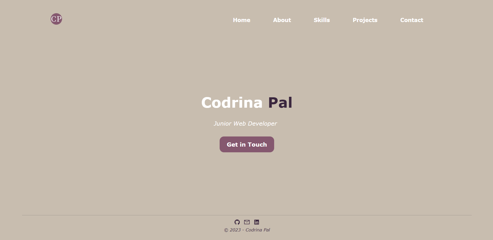
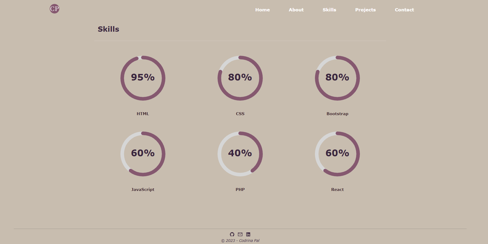
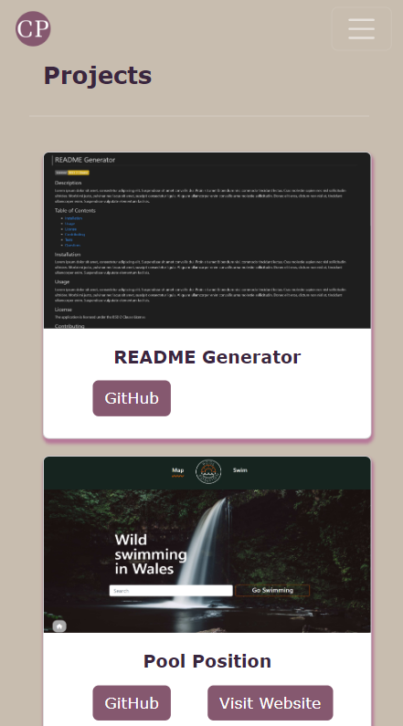

# Portfolio

## Description

A personal portfolio which features GitHub projects and other information.

This project was built with:
* React.js
* Node.js
* CSS3

## Screenshots

## Installation

Clone this repository to your local machine. Ensure Node.js and Git are installed.\
Run the `npm install` and the `npm start` commands within the project directory.\
Open `http://localhost:3000` and the website will be displayed in the browser.

## Usage

In order to make edits to the components, navigate to the `src/components` folder.

## License

Please refer to the LICENSE in the repo.
